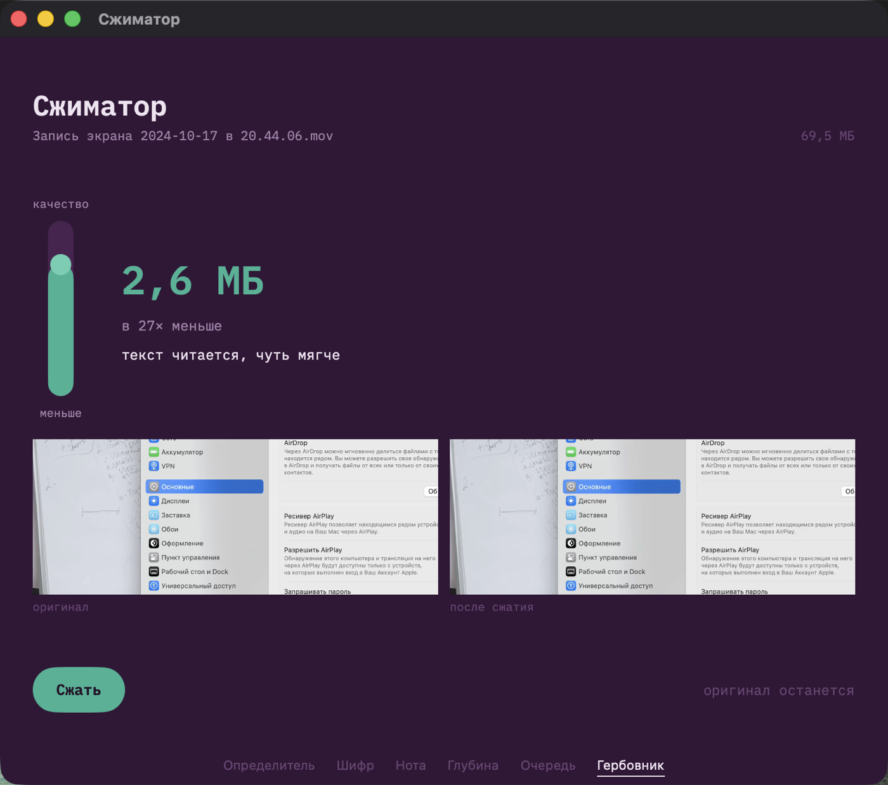

# Assay — выпуски

Здесь лежит только лента обновлений и сами файлы программы. Исходников тут нет.

**Assay** (по-русски «Сжиматор») смотрит внутрь видеофайла и сам подбирает
настройки сжатия под то, что в нём происходит: движение, мелкий текст, речь.
Одна ручка, предсказанный вес в мегабайтах и два кадра для сравнения — до и
после, из вашего же файла.

  

| | |
|---|---|
| `appcast.xml` | лента обновлений для macOS (Sparkle) |
| `appcast-win.xml` | лента обновлений для Windows (WinSparkle) |
| Releases | сами файлы: `.dmg` для macOS, `Setup.exe` для Windows |

Обновления подписаны Ed25519. Программа проверяет подпись перед установкой:
неподписанное обновление не встанет, даже если попадёт по этому адресу.

Автор — [Антон Карпов](https://karpovanton.me), независимый разработчик.

ffmpeg внутри — сборка [BtbN](https://github.com/BtbN/FFmpeg-Builds) под GPL,
текст лицензии лежит рядом с программой.
